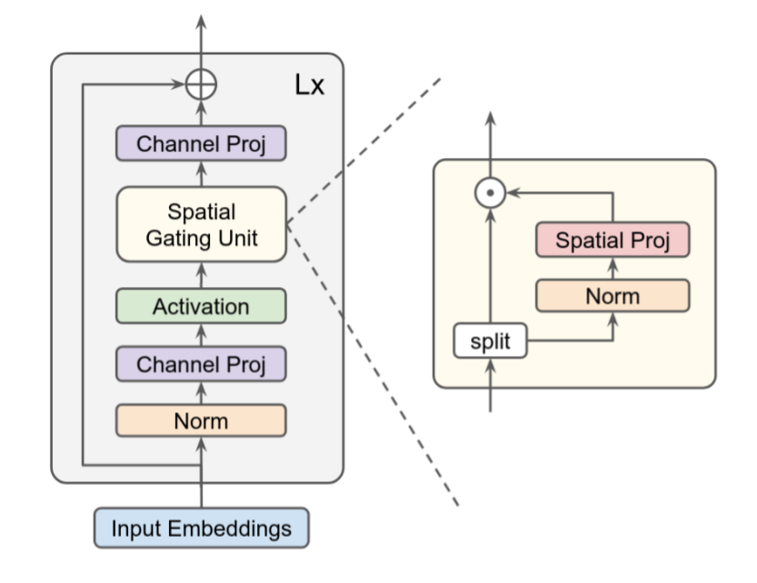

# Pay-Attention-to-MLPs
Implementation of the gMLP model introduced in [Pay Attention to MLPs](https://arxiv.org/abs/2105.08050).

  

The authors of the paper propose a simple attention-free network architecture, gMLP, based solely
on MLPs with gating, and show that it can perform as well as Transformers in
key language and vision applications.